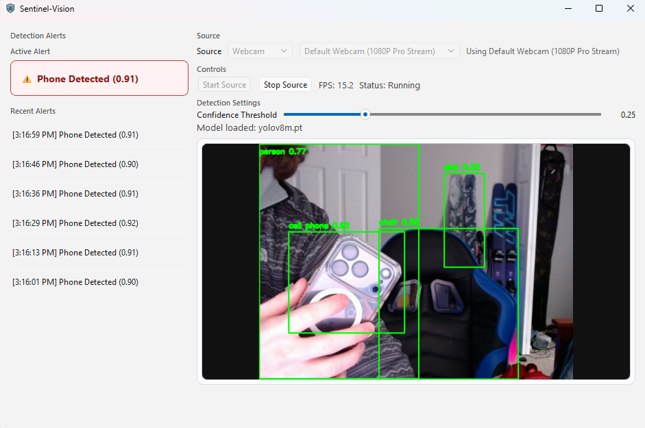
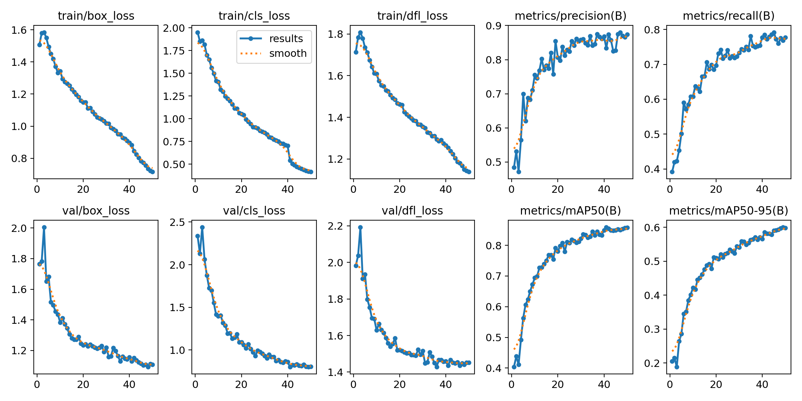
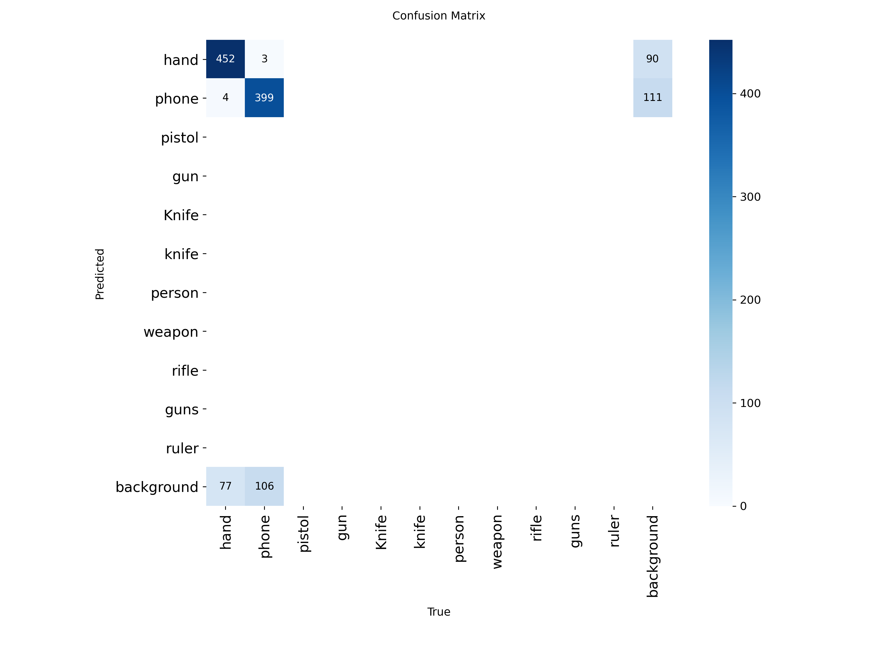

# 🛡️ Sentinel-Vision

**Custom-trained, real-time object detection system with a desktop interface (YOLO + PyTorch)**  
Built by Cody Sims

---

## 🎯 What This Does

Sentinel-Vision is a **locally deployed AI system** that detects objects in real time using a **custom-trained YOLO model**.

- Processes live webcam or video input
- Detects objects frame-by-frame
- Triggers alerts based on confidence thresholds

### 🚨 Demo Behavior
- Alert is triggered when a **cell phone is detected**
- Confidence threshold set to **>90%**
- Designed to demonstrate real-time monitoring + alert logic

---

## 🎥 Preview

---

## 🧠 Model Training & Evaluation

- Model: **YOLOv8m**
- Framework: PyTorch (Ultralytics)
- Training: **transfer learning on custom dataset**
- Hardware: **CUDA-enabled GPU (local training)**
- Epochs: ~50

### 📊 Performance
- Precision: ~0.87  
- Recall: ~0.78  
- mAP@50: ~0.85  
- mAP@50-95: ~0.60  

### 📈 Training Results

Training curves show consistent convergence with decreasing loss and increasing precision/recall, indicating stable model learning.

### 📊 Confusion Matrix (Validation Set)

---

## ⚙️ System Overview

Pipeline:

- ~15 FPS real-time inference
- Bounding boxes + class labels + confidence scores
- Adjustable detection threshold
- Runs fully **on-device (no cloud)**

---

## 💻 Application Features

- Real-time object detection
- Webcam + video file input
- Confidence threshold slider
- FPS + system status display
- Multi-camera selection
- Built-in alert system
- Packaged as **Windows desktop app (.exe)**

---

## 🔐 Security & DevOps

- Local-only processing (no external APIs)
- CI/CD pipeline (GitHub Actions)
- **SAST (Bandit)** + dependency scanning (SCA)
- Pinned dependencies for reproducibility

---

## 📦 Install

Download from **Releases**:

Steps:
1. Run installer  
2. Launch app  
3. Select input source  
4. Click **Start**  

> SmartScreen → “More info” → “Run anyway”

---

## 🖥️ Requirements

- Windows OS  
- Webcam (for live detection)  

Runs on CPU for inference.  
GPU (CUDA) was used for **model training (not included in this repo)**.

---

## 📄 License

MIT